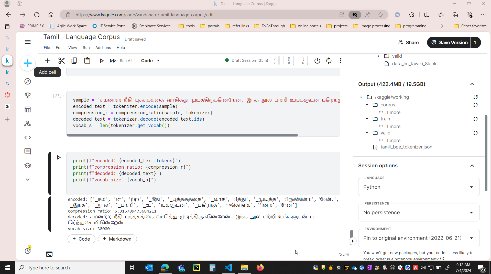
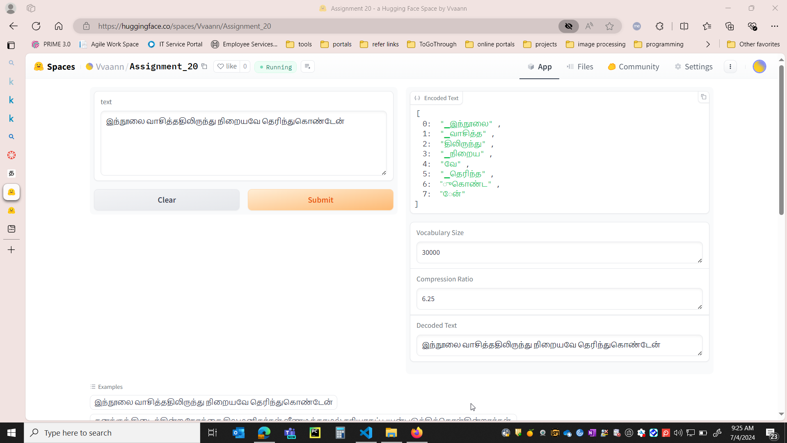

# Assignment 20

## Problem Statement

I have selected tamil language to build own Byte Pair Encoding for this language. Data collated from kaggle notebook.

This repo contains related files

        tamil-language-corpus.ipynb
        tamil_bpe_tokenizer.json
 

## Results

The code is trained in kagggle and the training file is **tamil-language-corpus.ipynb**
Hugging space link: https://huggingface.co/spaces/Vvaann/Assignment_20

vocab size: 30000
compression ratio: 5.31

gradio app 

